# ADS Web & BE Task 1
## Intro

package-package laravel yang digunakan : 
- media library 
- activity log
- yajra datatables
- laravel ui
- sweet alert

Berikut adalah commang-command yang dijalankan saat inisialisasi project
```
composer require spatie/laravel-medialibrary
composer require spatie/laravel-activitylog
composer require yajra/laravel-datatables-oracle
composer require laravel/ui
php artisan ui bootstrap --auth
composer require yajra/laravel-datatables
composer require realrashid/sweet-alert
php artisan sweetalert:publish

php artisan vendor:publish --provider="Spatie\MediaLibrary\MediaLibraryServiceProvider" --tag="migrations"
php artisan vendor:publish --provider="Spatie\MediaLibrary\MediaLibraryServiceProvider" --tag="config"
php artisan vendor:publish --provider="Spatie\Activitylog\ActivitylogServiceProvider" --tag="activitylog-migrations"
php artisan vendor:publish --provider="Spatie\Activitylog\ActivitylogServiceProvider" --tag="activitylog-config"
```

## Pages and Features

### Public Report Datatable (/) : guest

Di page ini, terdapat datatable dari Model Reports yang berstatus publik, namun tidak dapat di ubah maupun dihapus.
Berguna untuk reporter mentrack report mereka sudah sejauh apa.
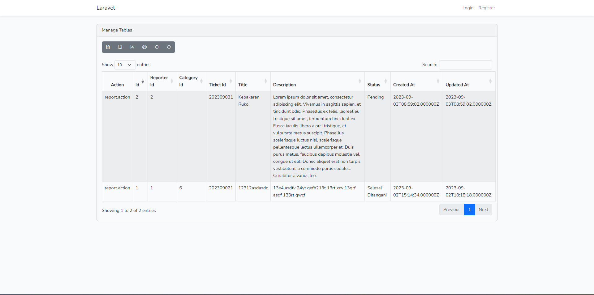


### reporter form (/report) : guest
Di page ini, public (aka, reporter) dapat menginput pengaduan melalui form yang disediakan
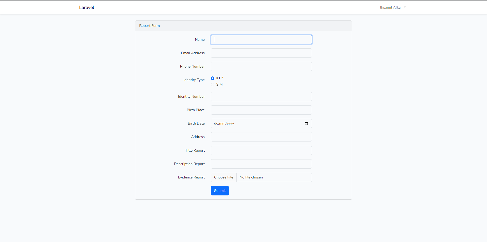

Jika form berhasil submit, maka akan ada popup bertipe success
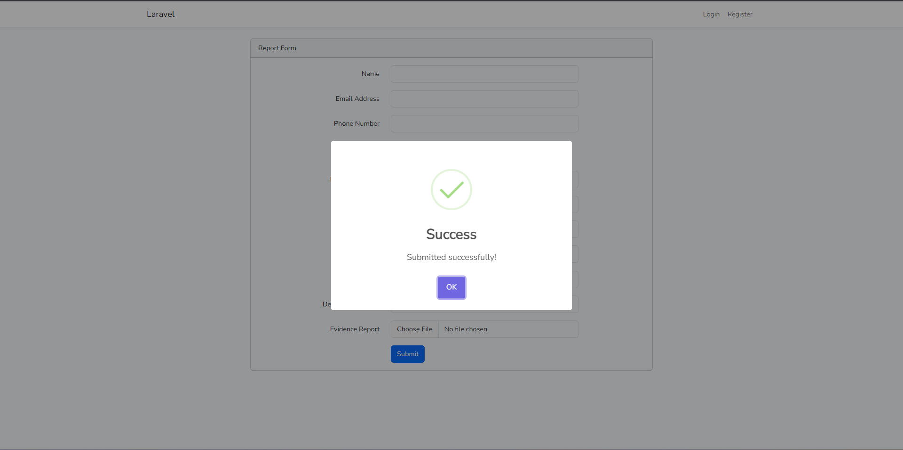


### Register & Login (/register & /login) : guest

Berikut tampilan form register
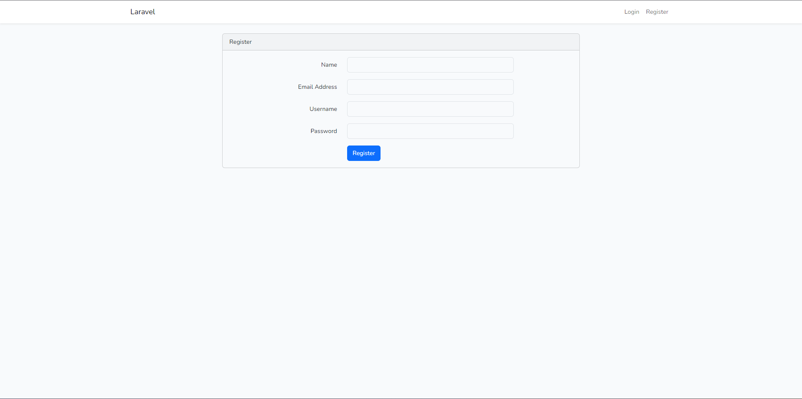

Jika register sukses, maka akan muncul popup success dan redirect ke page login
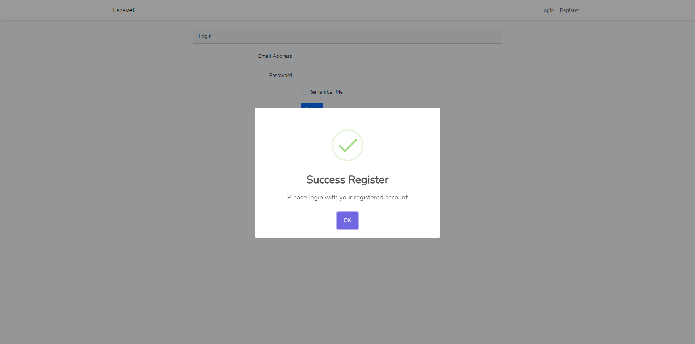

Jika gagal, maka akan muncul popup warning
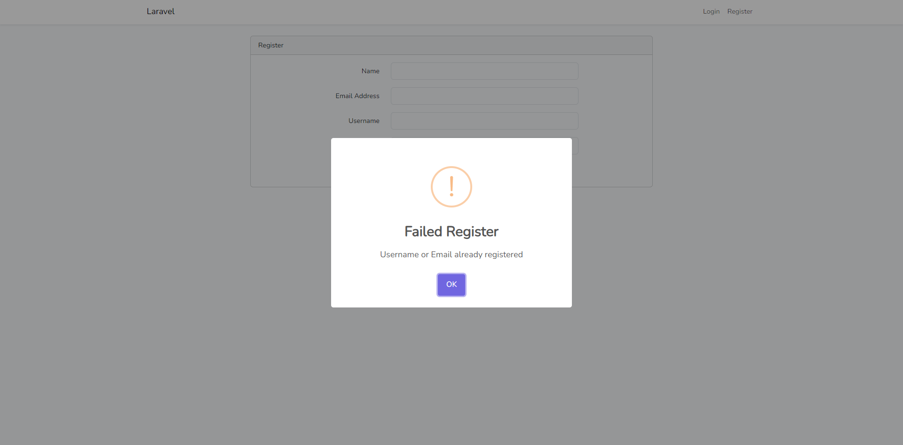

Untuk login, jika login sukses maka akan redirect ke `/dashboard`. 

Berikut contoh form dan contoh gagal untuk login.
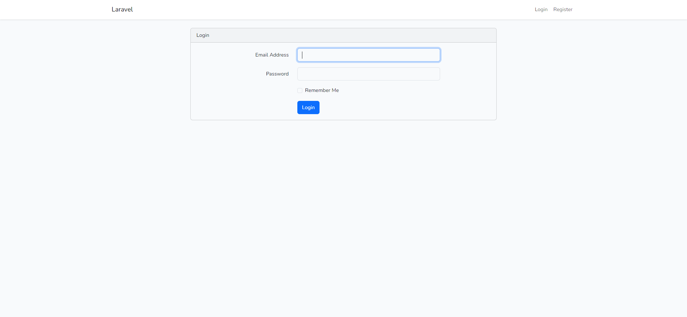
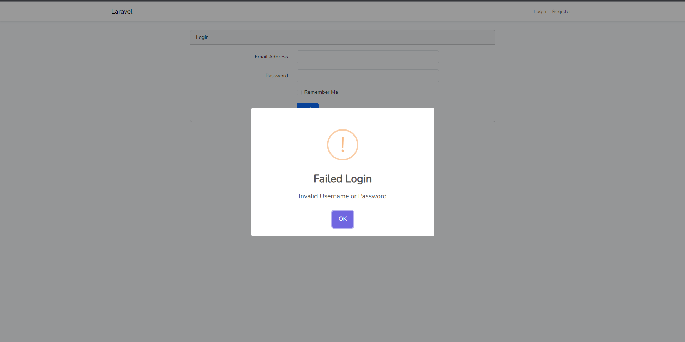

### User Report Dashboard (/dashboard) : auth

Disini, user dapat melakukan edit pada data report.

Tampilan awal page 
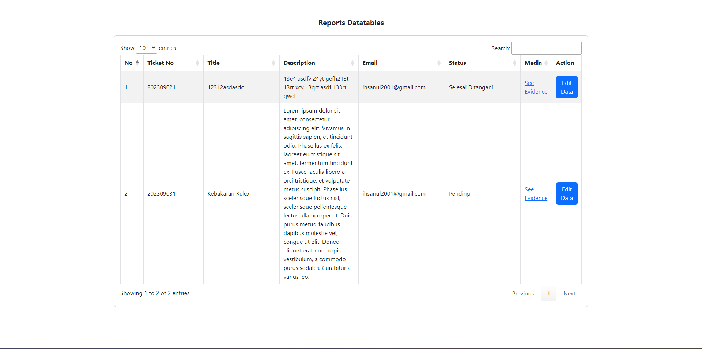

Terdapat column `Media` untuk melihat bukti yang dimasukkan reporter.

Modal popup untuk edit data
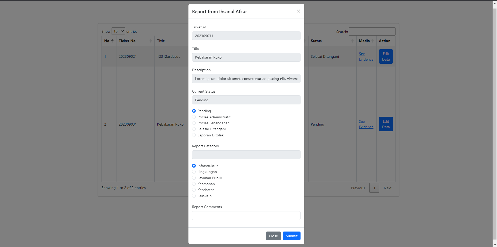

Jika edit data berhasil, akan muncul popup.
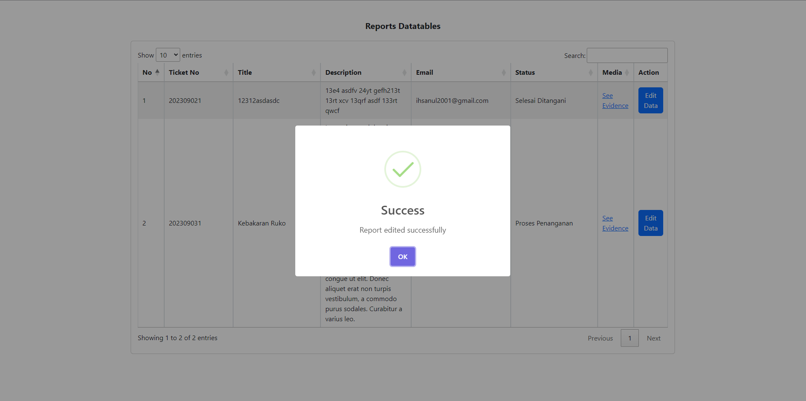

### Report Tracker Datatables (/history) : auth
Terdapat datatables untuk menampilkan Model ReportTracker. Dimana ReportTracker berfungsi melacak perubahan yang ada pada Reports. Berikut tampilannya.
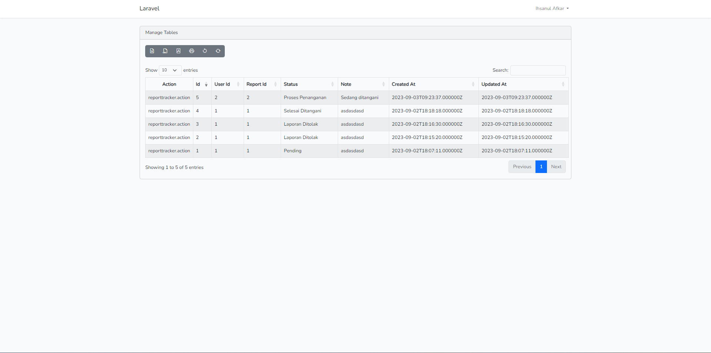

### Activity Log Datatables (/activity) : auth
Activity log berfungsi untuk melacak penambahan, penghapusan, maupun perubahan data pada table Users, Reports, ReportTrackers, Categories.

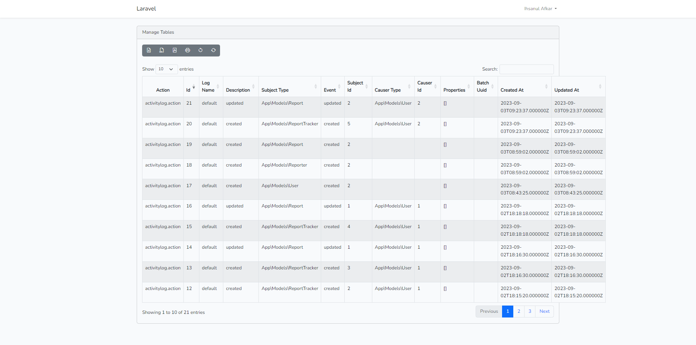

## Lain-lain

Untuk implementasi migrasi dan seeder, dapat dilihat di [database](database/)